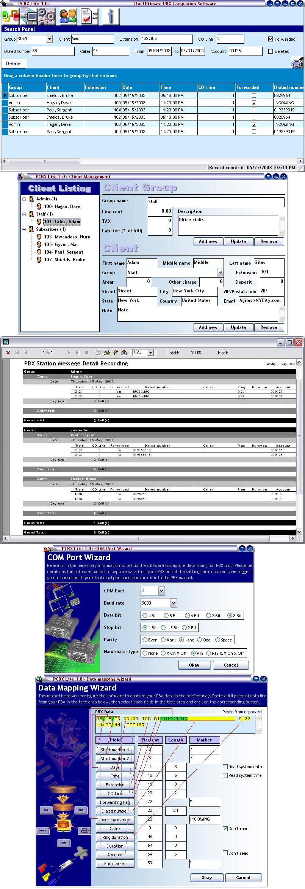

## PCBX Lite 1\.0 &gt;&gt; The Simplest Effective PBX Data \(SMDR\) Processor

### Description

Please download the installer from "http://www.MegaShare.com/292126" that will install all required files to run the source code.

----

This is a complete application to communicate with a PBX unit through RS232C serial COM port and download data (SMDR) automatically and store them in an MSAccess 2000 database using ADO. It has client management, data reporting feature (you must have Crystal Reports installed to use this feature).

----

Download Installer at http://ugibd.net/privatespace/joy/PCBXLite/PCBX%20Lite%201.0.exe
 
### More Info
 
&lt;h3&gt;COMPLETE BINARY & LIBRARY DOWNLOAD = http://www.MegaShare.com/292126&lt;/h3&gt;

             |
---                |---
**Submitted On**   |2003-09-28 21:44:24
**By**             |[Broken Arrow](https://github.com/Planet-Source-Code/PSCIndex/blob/master/ByAuthor/broken-arrow.md)
**Level**          |Intermediate
**User Rating**    |4.8 (63 globes from 13 users)
**Compatibility**  |VB 6\.0
**Category**       |[Complete Applications](https://github.com/Planet-Source-Code/PSCIndex/blob/master/ByCategory/complete-applications__1-27.md)
**World**          |[Visual Basic](https://github.com/Planet-Source-Code/PSCIndex/blob/master/ByWorld/visual-basic.md)
**Archive File**   |[PCBX\_Lite\_1651479292003\.zip](https://github.com/Planet-Source-Code/broken-arrow-pcbx-lite-1-0-gt-gt-the-simplest-effective-pbx-data-smdr-processor__1-48859/archive/master.zip)

### API Declarations

&lt;h3&gt;COMPLETE BINARY & LIBRARY DOWNLOAD = http://www.MegaShare.com/292126&lt;/h3&gt;

